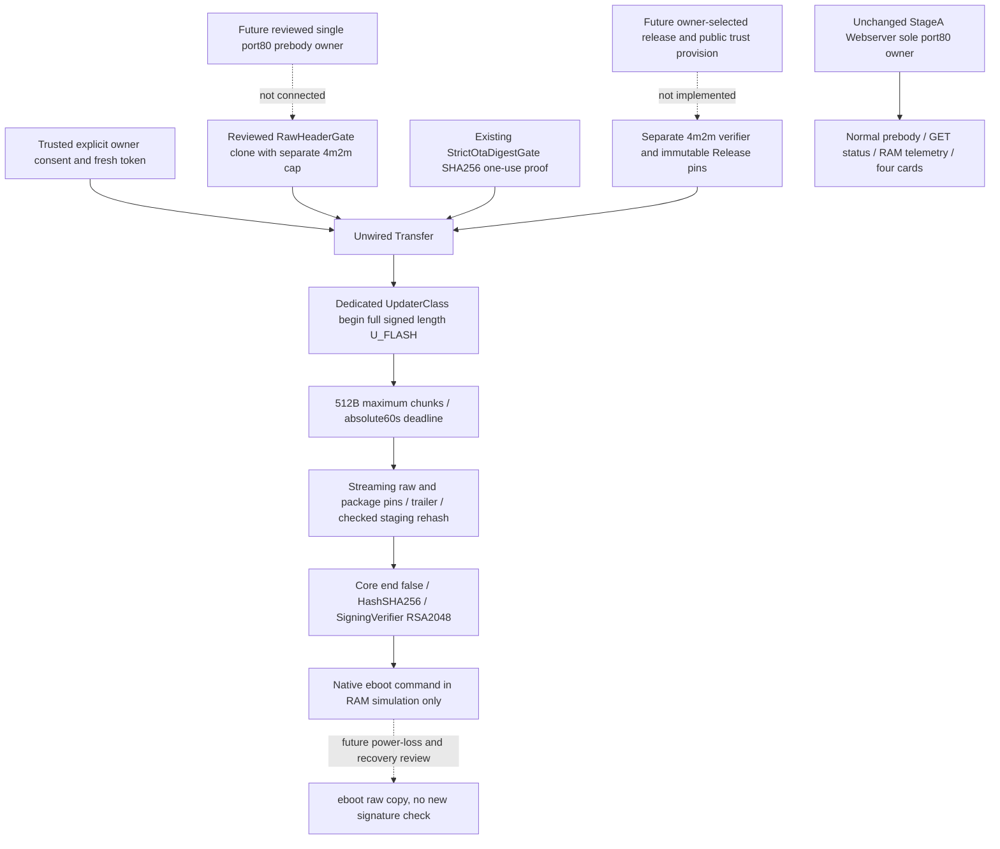

# Mission 9 Phase S — signed OTA substrate, offline and unwired

Owner instruction: [PR42 comment6065735151](https://github.com/shinobione/SHINO-TV/pull/42#issuecomment-6065735151),
8 October2026. Start: clean `7455f6b353f1733a78f2a6d25503edb063f7befb`,
`feature/shino-tv-m9-flash-layout-liberation`; same Draft/open/unmerged PR42.
Final commit and exact-head CI run IDs/results are recorded in PR42; CI uploads
only public JSON evidence tagged with the full checkout SHA.

**SIGNED_OTA_OFFLINE_GATE=PASS_UNWIRED_ONLY. Production integration=HOLD.**
This implements and executes release verification, permission/stream state and
the actual pinned native signing/commit chain. It adds no installed OTA route,
network owner, trust anchor, release signing service or usable recovery path.
All Phase S physical/production execution gates are **NOT_RUN**.
DEVICE CONTACTS=0; SERIAL I/O=0; FLASH WRITES=0; RTC WRITES=0; REBOOTS=0;
DEVICE FS WRITES=0. Host RAM simulates flash/RTC; host loopback sockets serve
synthetic traffic only. No private credentials, owner BIN, LittleFS, backup or
signing key was read. No physical writer, frozen bytes, ABI flags or deployed
firmware/companion source was changed; all113 retained firmware LF pins pass.

Phase R HTTP200/resource-floors PASS is owner evidence in the latest comment.
NORMAL_PROFILE_LITTLEFS_MOUNT_GATE=PASS remains owner evidence;
NORMAL_PROFILE_RUNTIME_GATE=HOLD/PARTIAL and intermittent404 unattributed.
Historical NOT_RUN/HOLD receipts are retained.

## Reused chain and ownership

Audited all `NativeOta*` review classes, the signed OEM stream/precommit/commit
barriers, [PR20](https://github.com/shinobione/SHINO-TV/pull/20),
[V2.1 safety research](V21_NATIVE_OTA_MANAGER_SAFETY_GATE.md), pinned Core3.1.2
Updater/Signing/BearSSL/StackThunk/eboot, `m9_flash_layout.py`, and Phase N's
normal HTTP prebody patch. PR20 is unwired research, not a live updater.

`M9SignedHttp.h` retains the reviewed raw header class body exactly except its
class name and signed-size cap. It aliases historical result/request types;
the original header/OEM494144-oriented contracts are unchanged. The existing
`StrictOtaDigestGate` is reused directly: exact POST URI, SHINO-OTA/SHA256,
qop auth, nc00000001, exact nonce/opaque/peer,60s expiry and consumption.
Core legacy MD5 HTTP Digest does not independently bind the actual URI or
prevent nonce-count replay, so it is not used to authorize this writer.

Historical manual-consent/intent/stream/OEM barriers supply the reviewed
ordering and fail-closed concepts. They are not enlarged or wired. A separate
4m2m `Release`, `Layout` and `Transfer` implement the current application limits.
`m9_first_migration` contributes its pure ESP segment/checksum/Arduino CRC
parser; `m9_flash_layout` contributes geometry constants/rounding.

The adapter owns a **dedicated signed-only UpdaterClass**, never global Update.
It independently checks current flash/mode/FS/geometry and public DER hash,
installs native HashSHA256/SigningVerifier, stages full transport, checks reads
and both staged hashes, and calls `end(false)` once after precommit. Native
RSA success precedes `_verifyEnd()` and `eboot_command_write()`.
There is no end(true), MD5 fallback, verifier disable, retry or reboot.

Core `_reset()` retains signing pointers; Core `end()` selects signing **else**
MD5. The source-executed lab proves a wrong MD5 is skipped in signed mode.
The existing factory/native compile interlock and StageA static_assert stay
closed. Dedicated ownership isolates this research instance; it does not
prove a production-wide mutex against unsigned OEM return or global writers.

## Implemented release and transfer contract

`tools/m9_signed_release.py` validates exact E9 boot/application framing,
segment bounds/alignment/nonoverlap/IROM offset, XOR checksum, Arduino size/CRC,
4MiB DIO40MHz, exact4m2m linker selection, RSA2048/SHA256 via independent
OpenSSL, exact256B signature plus LE32=256 trailer, independently selected raw,
package and public DER SHA256 pins. It never signs or installs; default CLI is
an offline library audit. A binary alone cannot establish linker provenance;
the independently reviewed selected release supplies that provenance.

| Geometry | Current rounded | Signed transport | Signed rounded | Stage range | Guard |
| --- | ---: | ---: | ---: | --- | ---: |
|399264 → public100000 raw|401408|100260|102400|[1994752,2097152)|1593344|
|1044464 → max1044464 raw|1044480|1044724|1048576|[1048576,2097152)|4096|

No fixed AB slot model. Every staging sector is below FS0x200000 and above the
rounded installed app, with at least4096B guard. LittleFS[0x200000,0x3FA000)
and tail[0x3FA000,0x400000) are excluded. Maximum raw remains0xFEFF0.

Transfer requires independently supplied immutable selected pins, trusted
explicit consent, exact `{"confirm":true}` body, nonzero32-hex intent, private
AP interface and selected peer within192.168.4.2–254, exact192.168.4.1 Host and
http://192.168.4.1 Origin, exact arm/upload endpoints and separate strict Digest.
Header cap2048B/24 headers; duplicate headers, TE, Expect and encoding reject.
No cookie grants authority. Upload size must equal raw+260 before native begin.
Each chunk is nonempty, at most512B, at its exact next offset and under an
absolute60s deadline; disconnect/budget/header/hash/trailer/overflow/duplicate
failures poison the single-use transaction. Native end is withheld until full
stream, independent hashes and checked staged rehash pass.

Approval/nonces are one-use and volatile within these objects. CSPRNG,
owner UI/HA1 provisioning, cross-object token registry and persisted antirollback
are future reviewed seams. Public fixtures reuse known tokens solely for tests.

## Executed evidence and meaningful limits

*10 deterministic Python release regressions PASS*: positive independent
OpenSSL signature; full fixture identities; unsigned/truncated/extra/trailer;
wrong selected raw/package/trust hashes; matching-package bad signature;
incorrect signer; headers/CRC/checksum/segments; max geometry and size/linker
negatives; no callable setup route or embedded fixture key.

*Actual pinned Core lab*:250 transactions,2118287 assertions;197 interrupted
512B boundaries including fully staged data;32 partial RTC-command writes from
cleared RAM state. Replays, duplicates, expiry, peer/interface, Host/Origin,
Basic/bad Digest, consent/body, resource failures, changed source/signature,
incorrect signer/key, trailer, bad header, offset/empty/oversize/truncation,
disconnect, staged corruption, failed checked read/write/erase are exercised.
Precommit-failure boot dispatches=0: each uses actual eboot command read/CRC
validation before considering ACTION_COPY_RAW. No physical power cut/copy runs.
Postcommit corruption is deliberately demonstrated as **unprotected/HOLD**.

The host lab executes pinned Updater.cpp unchanged, the exact extracted
HashSHA256/SigningVerifier function bodies, real pinned BearSSL RSA/SHA code,
and eboot_command.c unchanged. Explicit host seams replace ESP flash with RAM,
RTC address with RAM, key declaration/fixture parsing, Arduino APIs and thunk
allocation. MSVC removes GNU alignment annotation for host compilation only;
host Core private visibility permits simulated process-reset cleanup without
end-to-reset. RSA execution is real; hardware, thunk high-water and power-loss
behavior are modeled.65 LF-normalized public Core/crypto/linker pins prevent
silent changes. The real Xtensa graph uses the real framework declarations,
allocation and APIs, not these host declarations.

*Mixed-load model*: same retained pinned parser and actual StageA controller,
serializer/FslessMetrics/dashboard, one existing listener;392 successful normal
GETs,49 accepted LINK-format samples with all four values checked, during196
chunks/19600 virtual ms. No OTA route or listener is added. The temporary host
lab adds scheduler hooks, leaving Phase N/Q source and firmware unchanged.
Its RAM adapter models commit; native Core/RSA is executed in the separate lab.
This is not simultaneous native flash/crypto timing on an ESP8266. Retained
parser negatives and stock/Phase P urllib workload also run; runtime/404 gate
classification is unchanged.

*Xtensa/API proof*: espressif8266@4.2.1/framework3.30102.0, DIO/4MiB/4m2m;
`inert_baseline` and `signed_compile_only` link PASS. Signed proof is an internal
function retained by an internal volatile address. Setup only reads its address;
setup/loop never invoke it. No linker-exported OTA endpoint, key, credential,
selected release, AP or HTTP registration exists. Default and installed graphs
do not include this directory. Upload/buildfs/erase/monitor targets are refused.
The unsigned compile outputs stay ignored locally, are not signed with the
fixture key, are not frozen candidates and are not uploaded by CI.

| Linked research evidence | Baseline | Signed proof | Delta |
| --- | ---: | ---: | ---: |
|Static RAM including.noinit|28064|28984|+920|
|.noinit|56|56|0|
|Raw compile-only BIN|264560|308048|+43488|

Final resource JSON is authoritative for compiler-dependent frame/section sizes.
Maximum source frame is at most1120B (research root); strict Digest672B,
SHA provider192B, precommit464B and native Core end192B. Their partial call-path
estimate excludes deeper SHA/SDK/network frames; this is not stack high-water.
Keep original floors heap20480/block16384/frag25%/continuation2048. Admission
reserves6200B BearSSL thunk,4096B updater buffer,256B signature and512B chunk:
heap31544/block22584/frag25%/continuation4096. Public-key allocations precede
admission. Budget observations are privileged caller inputs, not upload claims.
No2048B downward adjustment. A4096B requirement may be unattainable in an actual
4KiB continuation callback; object placement/call graph must be redesigned and
measured before production. Header spans are bounded; never buffer the whole
upload in ESP RAM. Concurrent normal parser/JSON allocations and watchdog/native
RSA/precommit timing remain HOLD. Current frozen StageA resource evidence is
not a signed OTA resource qualification.

CI `m9-signed-ota.yml` mandates signing negatives, source/geometry/resource,
interrupted stream/RTC and no-writer/no-route gates at the exact checkout head;
existing CI retains default/profile0/profile2/StageA builds and companion tests.
Only public JSON is published. Source pins/unchanged start-head comparisons
retain all firmware/companion/physical-writer identity without reading owner
images. Final exact-head results/changed paths are in the PR42 receipt.

## Public inert fixture identities

All bytes are retained under `experiments/m9_signed_ota/fixtures`, with a checked
manifest. Raw data contains inert text at IRAM/IROM entry positions; it is not
an executable SHINO release. The private fixture key was created only in Node
memory and discarded with that process. No private-key file exists; public
modulus/exponent/DER and the inert signature are retained to make tests fixed.
The optional generator rejects every raw input except the exact inert raw hash.
No fixture key or package is embedded in the target graph.

| Public file | Bytes | Full SHA256 |
| --- | ---: | --- |
|raw.inert|100000|`67adaf4b86354b58beab6496dd5ed681ec77de93631297e6f1f65c8748947fb3`|
|signed.inert|100260|`b218d53ef13afa95206c4f02d3b307f8cb8257e3bbbbe356f37a928f8821380a`|
|public.der|294|`900453c460c3a19c17b6019595d4c2a4acc3d13b80ac18f67b01ade2b6be4c7f`|
|modulus|256|`fecb4b5c1b6fd4fc71915e64003fcdf1d60c610fe8a3d129d01effefbdefc81f`|
|exponent|3|`85f90dfea1d8027e1463e5ca971a250110a20df0119d204a74220bc63516d15b`|

## Remaining integration blockers and next reviewed stages

1. Independently provision owner **public** trust/key lifetime and selected
   release provenance; separately define owner-private signing outside Git/CI.
   No production key/signing occurred in Phase S.
2. Connect streaming prebody ownership to the existing single port80 owner
   under a new review. Existing normal parser buffers only bounded telemetry;
   adding ordinary server.on POST for the large body is prohibited. Define
   consent/CSPRNG/HA1/token lifetime and cross-request replay/antirollback policy.
3. Establish a firmware-wide signed/OEM writer mutex and lifetime. Never clear
   a verifier or attempt unsigned return through a signed instance. Failed full
   staging must not call end(false) merely to reset. Pinned Core lacks public
   safe abort; a poisoned instance can hold its buffer until reviewed reset.
   Automatic reset/retry is forbidden; production cleanup remains HOLD.
4. Measure object placement, parser/crypto concurrency, stack high-water,
   watchdog latency and resource admission on a separately reviewed candidate.
   Native signing has blocking work; current observations do not prove60s
   crypto-phase latency or a workable4096B continuation admission.
5. Resolve recovery separately. eboot checks command magic/CRC, not staging
   signature after commit; postcommit staging corruption with valid metadata
   can reach raw copy. Interrupted copy may corrupt the running app and is not
   atomic rollback. Partial RTC tests assume cleared state, not arbitrary stale
   commands. No physical installation/recovery qualification is claimed.

Only after those offline reviews may a separately authorized owner candidate
build/trust binding and installation plan be proposed. Any device operation
requires fresh exact-file/hash authority. Phase S ends at exact-head CI:
**STOP. No contact, flash, reboot, merge or production activation.**
