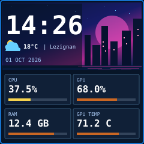
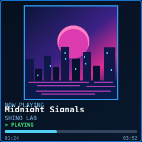
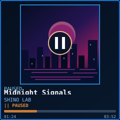
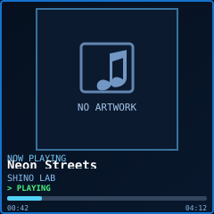

# SHINO // TV — Roadmap

> **Active product status — 1 October 2026.** This section supersedes the 28 September status claims preserved further below for historical traceability. One owner SmallTV-Ultra, exact 240×240 LCD, Wi-Fi-only maintenance (USB-C power; no UART/JTAG/solder). This is planning, not permission to flash, merge, provision a production key or deploy.

## 1 October 2026 — Canonical agent handoff and square design references

**Agents / Codex: read [AGENTS.md](../AGENTS.md) then [docs/AGENT_HANDOFF.md](AGENT_HANDOFF.md) before implementation.** They specify source precedence, verified status, one-unit Wi-Fi safety constraints, scene state transitions, prerequisites and acceptance checks. The older material below is retained without dropping any original detail. For canonical visual targets use [docs/design-reference/README.md](design-reference/README.md) and the actual **240×240 SVG images** (not scaled rectangular contact sheets):

| IDLE (clock + weather + 4 cards) | PLAYING (square cover, no metrics) | PAUSED (no metrics) | NO ARTWORK (no metrics) |
| --- | --- | --- | --- |
|  |  |  |  |

**Visual direction only, not a claimed native LCD screenshot.** Use native font/driver previews and measured ESP8266 resource tests to finalize. The [marquee overflow reference](design-reference/marquee-scrolled.svg) illustrates a long title moving *inside its own clipped line*, not shrinking the whole UI. The previous PR #40 96×96 cover + four metrics scene is a validated offline integration **test fixture only**; it is not the intended shipped mixed mode. Do not mistake the dated "native media BLOCKED" claims in the historical 28 September text for today's physically qualified 32×32 RAM receiver.

## Product contract — owner clarification, 1 October 2026

**One 240×240 (1:1) scene at a time. No mixed music + four-metric screen as the final product.** The PR #40 combined-artwork/four-card mock-up is a working *offline renderer/receiver integration pilot*, not accepted final interaction design. All future reference previews must be actual independently rendered 240×240-pixel PNGs (album covers square and not stretched), not wide illustration panels merely labelled 240×240.

| Scene / trigger | Display policy | Status |
| --- | --- | --- |
| IDLE / no active media session / music stopped | Large clock, optional current weather (temperature, configurable city and age), **all four PC cards CPU/GPU/RAM/GPU TEMP in 2×2**, no decorative micro-charts. Dynamic percent bars: 0–20 green; 20–50 yellow; 50–80 dark orange; 80–100 dark burgundy, with boundary/hysteresis and an explicit meaningful scale for RAM and temperature. Stale/unavailable values stay marked unknown, never fabricated. | Owner-preferred concept; scene/clock/weather integration NOT implemented on device |
| PLAYING | Dedicated music screen: prominent **square** committed artwork, title, artist, PLAYING indicator and progress/time when available. **No CPU/GPU/RAM/GPU TEMP cards.** Keep receiving PC metrics in background but do not paint them here. | Physical authenticated 32×32 RGB565LE *RAM receiver* qualified; LCD artwork only an offline PR #40 pilot |
| PAUSED | Artwork may be retained with a clear paused state, or return to IDLE after an owner-configurable delay. Exact pause timeout/transition is **OPEN OWNER DECISION**; never keep a false PLAYING indicator. **No metric cards while the PAUSED music scene is shown.** | Behaviour not finalized |
| PLAYING, artwork unavailable | Same dedicated music scene with a bounded tasteful placeholder/text and title/artist/progress. **No metric cards.** | Offline fallback pilot only |
| No PC / disconnected | Clock only if time was genuinely synchronized and its age is known; no invented local time or fresh PC values. Optional weather only when cached with displayed age; otherwise an explicit waiting/offline presentation. | Planned |

**Long title/artist:** do not squeeze, reduce the font to illegibility, or aggressively truncate. Implement a slow, bounded horizontal marquee **only on text overflow**, with a short initial hold, smooth/legible travel and pause/loop at endpoints; reset on track change and respect the existing metadata byte/UTF-8 limits and bitmap-font capabilities. No full-screen framebuffer or unbounded heap. Artist overflow follows the same bounded principle if needed. Native host preview and real LCD timing/readability checks required.

**Mode transitions to finalize before physical UI deployment:** PLAYING selects music; STOPPED/NO_SESSION returns to IDLE after a short debounced transition; PAUSED handling requires explicit owner choice (brief retained cover vs immediate return); incomplete/aborted cover transfers show deterministic fallback, never partial art. Music display never prevents reception of telemetry; media network outage must not blank a working clock/metrics scene.

## Current verified engineering position

| Workstream | Actual current state (1 October) | What this does NOT prove |
| --- | --- | --- |
| Device + SHINO // LINK | New 446,944-byte Mission 8 candidate installed; four PC readings, Digest-aware Windows tray and tested automatic recovery. SHINO private AP at 192.168.4.1. | Not household-LAN STA; prior 7.266-second accepted-sample gap means strict 6-second long-term telemetry continuity remains HOLD. |
| Native media wire and crypto | PR #39 Draft, validated HEAD `9fce7137f9fadd83678887442bf91cf60ea86b2e`. Physical current-candidate 32×32 Commit + replacement PASS, negative Abort/CRC and 2,048-byte arena peak (1,984 bytes) measured. R3 freshness PARTIAL, R10 production provisioning BLOCKED. | Not permanent signed media sender, production release or physical LCD cover rendering. 48×48 current-image replacement remains experimental: conservative 10.142 s against unchanged 8 s. |
| LCD artwork / V2.2 scenes | Existing PR #40 Draft now implements exclusive IDLE / PLAYING / PAUSED / NO ARTWORK / OFFLINE scenes, 160×160 integer cover (128 alternative also tested), bounded clipped title/artist marquee, 448-byte owned row, zero renderer heap. 33 actual native-receiver host cases pass at both sizes; linked +1,080 static DRAM / +5,456 BIN bytes versus the prior PR #40 graph. [Implementation, eight native-font 240×240 PNGs and numeric evidence](artwork-pilot/README.md). Prior mixed-screen proof and its reports/previews remain historical. | **OFFLINE PASS; physical UI NOT RUN.** Real LCD latency/readability, heap/block/stack and exact-image installation remain separately gated. No new owner-device write; current installed M8 candidate is unchanged. |
| Clock/weather | Earlier desktop scene ideas and product requirements only; authoritative on-device clock source and weather provider not finalized. | Neither trustworthy clock after power loss nor live weather is already shipping. |
| Household Wi-Fi (STA) | Existing product code operates in private AP mode. The separate upstream WiFiManager does not make STA available in the currently active FirstBoot bridge. | Current SHINO is not normally reachable on the owner's home LAN. |
| SHINO→SHINO native OTA | Existing `GET /api/v1/bridge/ota/capabilities` is **READ-ONLY** and reports `native_ota_writer_compiled=false`, `native_ota_upload_route_registered=false`. PR #20 and inherited safety work have signed-package verification, intent/request/precommit, pinned Core 3.1.2 and extensive **host/compile-only** evidence; only the *exact OEM-only factory-return* writer is physically exercised. Today each changed SHINO BIN still goes SHINO→verified OEM→SHINO. | There is currently **NO enabled in-firmware generic SHINO→SHINO upload/install path**, no seamless/atomic rollback, and no Wi-Fi rescue if neither application can boot. |

## Priority roadmap (product milestones, NOT another 40 independent missions)

> **LATEST VERIFIED P0 STATUS — 1 October 2026, PR #40 `332eaa48580de60eba06faaa6dbb67c301b2b1be`: OFFLINE GO / PHYSICAL LCD HOLD.** The mutually exclusive `IDLE`, `PLAYING`, `PAUSED`, `NO ARTWORK`, `OFFLINE` C++ scene engine, 160×160 5× cover upscale and bounded title/artist scrolling are implemented. Actual eight independently produced 240×240 renderer previews. 33 host scenarios pass for both 128 and 160px artwork, ASan/UBSan pass, exact-head push and PR CI each 12/12. Public paired build delta against preceding PR #40 pilot: **+5,456 padded BIN bytes, +1,080 static DRAM bytes, 448-byte row buffer, zero observed renderer dynamic heap; Receiver Begin compiler frame +64 B.** No live native LCD timing/heap/stack has been measured, providers for clock and weather do not exist yet, and no device flash/reboot has occurred. The IDLE concept-city background is not a requirement to store or render large native art without resource proof. `GPU TEMP` bar remains neutral until a documented scale is approved. The next implementation priority is **P1 secure normal-home-LAN STA with protected private-AP fallback**, followed by P2 integrated signed SHINO→SHINO OTA. Do not conflate OFFLINE GO with physical approval.

### P0 — Freeze interaction specification and finish offline scene prototype (OFFLINE IMPLEMENTED; physical acceptance pending)
- [x] Implement the 240×240 IDLE clock/weather validity seams, four cards, reviewed bar boundaries/hysteresis and explicit RAM denominator. No micro-curves; GPU temperature has a neutral track pending an approved scale. Native clock/weather providers remain absent; previews label synthetic data.
- [x] Refactor PR #40's combined view into **mutually exclusive** IDLE / PLAYING / PAUSED / NO ARTWORK / OFFLINE scenes, with eight actual C++/pinned-font 240×240 PNG outputs and native resource comparison. Physical LCD qualification NOT RUN.
- [x] Add bounded slow clipped marquees for title and artist, preserving full 60-codepoint metadata, receiver ownership, wire-v2 bounds and loop-side rendering. Both 4× and 5× host/native options validated; exact-head Linux CI runs ASan/UBSan.
- [ ] Record owner decision on PAUSED duration/return to IDLE and artwork fallback; do not silently pick a scene-switch policy.
- **Implementation status:** offline scene milestone complete. PAUSED timeout seam defaults to disabled/retain; final owner timeout remains OPEN. STOPPED debounce is bounded at 300 ms. Signed position is labelled REPORTED, without invented interpolation because wire-v2 has no observation timestamp. Real providers and physical LCD timing/readability remain open. The historical roadmap appendix below is unchanged.
- **Exit:** tested offline UI/state machine, signed 32×32 receiver handoff preserved, measured linked RAM/individual compiler-frame budget and bounded SPI work. Actual native LCD timing/high-water awaits separate physical approval. No flash.

### P1 — Home LAN as the normal operating network (high priority, before further routine UI flashing)
- **Owner preparation decision, 2 October:** continue existing Draft PR #41 from exact `ce718f0c47398ff70043b012cd3fb5d94c25aa74`; prepare and locally verify an actual private P0+P1 owner candidate, matching retained credentials/media identity and OEM/V2.1 rollback, plus allocation-lifetime review and explicit physical abort/test sequence. STOP at a new exact-image installation authorization gate. No installation, persistent Wi-Fi write, network migration, destructive OEM return, merge, native OTA activation or Mission 9 is authorized by this preparation. The accepted 13/13 offline runs remain historical evidence; future device evidence must be recorded separately.
- **Preparation result, 2 October:** private active candidate 464544 B / SHA-256 `31e3f225744bd806df3302dbf3355770a313f8b71f65b33fd6e2f431449b0be5`; actual linked DRAM 55504 B, reviewed DIO/4 MiB/40 MHz headers/Core CRC/4m3m ELF offsets, retained AP/Digest/media identity and exact OEM/V2.1/M8 rollback hashes locally checked. Fresh current-M8 GET-only identity/flash/OEM/native-OTA preflight PASS; no writes/reboot/network switch. [Exact installation gate, allocation lifetimes, numeric abort limits and sequential plan](home-lan/OWNER_INSTALL_GATE.md). **P1 DEVICE NOT RUN / HOLD; exact two-hop installation approval pending, followed later by separate first persistent credential-write confirmation.**
- **Owner decision, 1 October:** persistent household Wi-Fi is mandatory. Provision locally once through a protected interface; reviewed SDK non-volatile storage must survive reboot/power loss, retain credentials on failed association/DHCP, retry automatically, and write only on explicit Change/Forget. A RAM-only candidate cannot complete P1. ESP8266 uses 2.4 GHz and WPA2; household SSID/password and QR payloads stay outside Git/CI/chat. Preserve private AP recovery, Digest on LAN and the exact OEM return. No installation, device contact or network migration is authorized.
- **Offline implementation (follow-on from PR #40 `a3d9fdb`):** persistent SDK station adapter with exact 4m3m/layout gate and saved readback; bounded DHCP/reconnect state machine, temporary AP+STA then STA-only, protected AP recovery/reopening, masked local Change/Forget command, strict numeric Host/Origin/interface policy and AP-only OEM writer. LINK retargets its existing sender from local configuration. Three guarded native graphs compile; +11,136 BIN / +1,180 static DRAM versus paired P0. 183 shared assertions, 34 real-handler loopback checks and 33 signed native receiver/scene cases at each AP/LAN authority pass locally. [Exact procedure and evidence](home-lan/README.md). **P1 remains HOLD for actual power-loss persistence, heap/block/stack, radio/router/DHCP and OEM-return qualification; no physical installation/provisioning/migration authorized.**
- [ ] Add an explicitly provisioned **STA/home-Wi-Fi mode** in the active FS-less FirstBoot profile. PC and SmallTV share the owner's usual router/LAN, without Windows repeatedly joining SHINO's isolated AP. DHCP plus discoverability (mDNS if reviewed, documented address fallback); no requirement to expose device to Internet.
- [ ] Define secure owner-local Wi-Fi credential onboarding/storage without publishing secrets or introducing unsafe stock-filesystem writes. Never substitute household SSID security for API auth.
- [ ] Maintain a tested **private AP recovery/provisioning fallback** if SSID/password/router is unavailable; model STA timeout, retry/backoff, reboot, IP changes, mode transition and lost-connection recovery. AP+STA hybrid is optional only if heap/radio/load measurements allow it.
- [ ] Audit the HTTP Host/Origin/peer/IP/session and OTA policies: several existing privileged contracts are deliberately hard-coded to the private AP at 192.168.4.1; adding STA must not accidentally expose write routes or bypass authentication.
- **Exit:** offline tests, bounded field transition plan and a demonstrable no-lockout path; still no device write without exact-image approval.

### P2 — Native signed SHINO→SHINO OTA (top platform priority; eliminate recurring OEM detour)
- [ ] Integrate a real owner-authenticated, bounded, one-use signed updater **inside running SHINO**; current read-only Phase A and isolated gates are research components, not a callable writer. Exact image/size/header/layout/hash, independently pinned signing key, challenge/consent, signed transport and core `Update.end(false)` verification.
- [ ] Resolve ESP8266 global `Update.installSignature` interaction: signature verification can suppress legacy OEM `setMD5` verification. Preserve a separately reviewed **signed AND byte-exact pinned-OEM return**, or a demonstrably safe separated arrangement. Never silently sacrifice the proven OEM escape route.
- [ ] Authenticate privileged operation BEFORE unbounded request-body reads, single-owner streaming and strict lengths, interrupt/error cleanup, staging/eboot limits and actual flash geometry. Investigate interrupted transfer resume only if it can be implemented safely and bounded; distinguish network resume from true power-loss-safe rollback.
- [ ] Stage host/CI tests, memory/link reviews, interrupted-transfer fault injection and a separate explicit owner go/no-go for the exact release image. No claim of no-boot Wi-Fi rescue.
- **Exit:** physically validated running SHINO→new signed SHINO update without OEM downgrade, while preserving authenticated OEM return. Until then, the documented double-hop is still the only demonstrated field route.

### P3 — Planned next hardware release (only after independent gates)
- [ ] Review whether STA + native OTA can fit and be activated together without risking the owner's only unit; prefer a staged safer rollout if combined change increases recovery risk. One further OEM-assisted transition may be needed to *introduce* the first self-updating SHINO build.
- [ ] Build/hash exact private owner candidate, prove rollback and live capability, request specific owner approval. Physical check: STA association, PC telemetry over normal LAN, AP fallback, signed OTA flow/recovery and all four IDLE cards.
- [ ] Confirm single-scene UX, native 32×32 actual artwork/display colours/orientation, title marquee and render/stack/heap margin. No extra firmware writes for cosmetic preview iteration.

### P4 — Deliver the end-to-end Now Playing user feature
- [ ] Extend separate Windows SHINO // LINK GSMTC pilot into a **reviewed opt-in bounded media sender**, detecting track/cover/state changes, sourcing and cropping artwork on PC, converting to 32×32 RGB565LE, authenticating media without disturbing numeric telemetry. No hardcoded player dependence or cloud secrets on TV.
- [ ] Display PLAYING art/title/artist/progress **instead of** metrics, PAUSED behaviour per owner sign-off, fallback without artwork, then return to clock/weather/metrics IDLE on stopped/no session. Confirm slow marquee on real 240px LCD.
- [ ] Keep the four metrics updating silently in the background during music; use safe explicit unknown/stale representation in IDLE.
- **Exit:** demonstrable normal-home-LAN end-to-end music and health scenes with measured LCD/heap/telemetry continuity.

### P5 — Clock, weather and comfort
- [ ] Clock sync from authenticated PC time initially; consider NTP after STA is safe. Track sync/age, timezone and DST; never invent a wall clock after unsynced boot.
- [ ] Configurable city/weather provider and cache (PC-fed first, opt-in) with freshness and offline fallback. No embedded weather/API secret on the TV.
- [ ] Brightness/night mode, stable visual states, typography and optional scene transition timing, subject to 240px/RGB565 limits.

### P6 — Optional improvements, never blockers for the 32×32 product
- [ ] 48×48 replacement needs meaningful 8-second timing headroom AND actual same-state retained-4608-image heap/largest-block measurements before a new physical attempt; no deadline/auth weakening.
- [ ] Strict longer-term telemetry six-second continuity analysis independent of demonstrated receiver PASS.
- [ ] R3 persistent freshness/replay and R10 production-key provisioning remain separate *release* blockers.
- [ ] Any additional widgets (code/agent/SHINOBIWAN release) only after stable base product.

## Decision register (unresolved, do not invent approval)

1. **Confirmed:** four metrics only in IDLE/PC health, **none** in music screens; each scene and artwork must obey 240×240 / 1:1 geometry. Curves above metrics removed; adaptive bar levels retained.
2. **Confirmed priority:** normal home-LAN STA instead of mandatory private SHINO AP; retain a reliable AP recovery/configuration option.
3. **Confirmed priority:** native signed SHINO→SHINO updating without OEM detour for every revision; current implementation is NOT ready.
4. **Confirmed:** overflowing titles scroll slowly and legibly, not compressed to fit.
5. **To decide:** PAUSED scene duration and return-to-IDLE behaviour; music-progress visibility if source reports incomplete times; fallback after cover interruption.
6. **To decide:** city, weather source/refresh policy, clock sync and optional idle background artwork (respect measured PROGMEM/flash/RAM).
7. **Safety boundary:** documentation or an offline prototype does not authorize any flash. No UART/JTAG/solder assumed; OEM application-only fallback cannot rescue an unbootable device.

---

## Historical product roadmap — retained for provenance (28 September 2026)

> The historical section below uses statements such as “current review-003” and “native media BLOCKED” in their original dated context. They are superseded by the **1 October active status and priorities above**, not current device facts.

> **Current owner-reported state, corrected 28 September 2026 during the V0.6 review:** the SmallTV Ultra runs private **V2.1 review-003**, frozen at source `8cef03012ae4a4864d69cbe20e02f141a36e2d54`. Its four metrics (CPU, GPU, RAM, GPU TEMP) work through the standalone **SHINO // LINK V0.1 Windows tray**. V0.4 music metadata/artwork/progress/pause-resume remain PC-local; V0.5 media transfer is host-only. Native media remains **BLOCKED** by pre-allocation HTTP bounds, production authentication and unproven heap headroom; see [V0.6 security review](V06_MEDIA_AUTH_AND_TRANSFER_REVIEW.md). This corrects the former review-002/current and review-003/not-installed wording using owner evidence, without a new device connection or private image inspection.

> **Binding constraint:** development/install via **Wi-Fi only**, USB-C for power. **No proposed adapter, UART, pogo pins, solder, PCB access, extra device or purchase as a normal dependency.** Hardware recovery is a break-glass discussion **only after an actual brick and only at the owner's request**. Older hardware-gate research retained below is superseded for this owner. The manufacturer OTA application image is **not** a 4 MiB full-chip backup. No guarantee of Wi-Fi rescue if the application fails to boot.

> **Source freeze:** the original product roadmap was developed on `planning/v22-shino-link-scene-roadmap`. These status corrections are on independent branch `feature/shino-tv-v06-native-audit`, descended from the frozen source. **PR #20 and its firmware remain unchanged.** Do not merge or cherry-pick development work into the frozen PR. Documentation is not device installation approval.

## 28 September 2026 — SHINO // LINK & V2.2 integrated product roadmap

### Current delivered functionality vs future design

| Capability | Historical review-002 evidence | Current V2.1 review-003 (owner-reported) | Future design |
| --- | --- | --- | --- |
| 240x240 four live metrics CPU/GPU/RAM/GPU TEMP, variable-color bars | Owner observed, working | Four metrics working through V0.1 tray | **Always preserved together** |
| Windows PC metrics push to `/api/v1/bridge/metrics` every ~2s | Manual sender worked | Standalone V0.1 tray works | Preserve numeric telemetry and existing tray |
| Invalid/absent samples expire in ~6s, no invented zeros | Present in V2 code | Retained | Scene transition based on explicit PC connectivity |
| Same-origin Chrome dashboard | Working | Retained | Configurable scenes and preview |
| Observed heap/free block/fragmentation 1Hz summary | Historical baseline | Opt-in diagnostics; historical samples are not guaranteed available headroom | Memory/stress analysis pending; media blocked |
| Exact pinned OEM return via authenticated Wi-Fi | Earlier GET/return observations only | Frozen exact-OEM application receiver retained in source; not rechecked here | Preserve boundary; no automatic flash or full-chip recovery claim |
| Native media / cover / clock / weather | Not in bridge | **Not part of review-003** | Native media BLOCKED; PC-local V0.4 music and V0.5 host tests are separate |

### Roadmap milestone A — SHINO // LINK Windows companion (PC only, zero TV firmware changes)

**Status correction:** V0.1 already provides the working standalone metrics tray; V0.4 provides a separate PC-local music bridge. The checklist below retains the earlier integration backlog and does not authorize replacing the tray or changing its autostart registration.

- [ ] Unify existing `companion/metrics_server.py` collector and `companion/push_fsless_metrics.py` sender into a small resident **SHINO // LINK** process, without altering today's bounded Digest telemetry contract. System tray, clear status (Connected/Retrying/PC offline), config outside repo, start on Windows user logon, delayed start and graceful exit; **no administrator rights or auto-install required by default**. Preserve manual CLI fallback and keep private owner credentials only on PC.
- [ ] Continue CPU usage, GPU usage, RAM actual used/total and GPU real temperature, update roughly **every two seconds**, GPU unavailable explicitly marked rather than fake 0°C; collector errors never replace last valid readings. Automatic reconnect with capped backoff, no busy-loop or repeated credential prompts; LAN-private target allowlist and no redirection.
- [ ] Use a **separate bounded music data provider** so music errors never interrupt PC metrics. Preferred initial provider is Windows **Global System Media Transport Controls (GSMTC)** when source applications expose artist/title, duration/position, playback state and optional thumbnail; confirm support per actual source/app. **Alternative selectable options:** Spotify API with owner opt-in and tokens confined to the PC, a compatible local-player adapter, or **media disabled**. Avoid claiming every browser/streaming app exposes a session or artwork.
- [ ] Local PC-only preview for both 240x240 native-screen concept and companion behavior: playing/paused/no title, missing cover, source switch, empty metadata, reconnect and silent/privacy mode.
- [ ] Capture owner choices: **launch on sign-in** [on/off], **media provider** [Windows session(default proposal)/optional Spotify/local/disabled], **media display** [brief track-change overlay (proposal)/permanent music scene/manual only/disabled], **show progress** [yes/no], **notifications** [none/tray only].
- **Acceptance:** default metrics behavior and refresh remain uninterrupted by media, tray or PC power-state simulation; tests are PC-only and use synthetic media/session fixtures. No need to upload a new device image while this milestone develops.

### Roadmap milestone B — 240x240 display scene system (software preview before flashing)

- [ ] Preserve exact **four simultaneously visible measurements** (CPU, GPU, RAM used and real GPU temp), their 90x6 bars, percentage-driven mint/yellow/dark orange/burgundy with hysteresis, correctly unknown/stale state. Never substitute album art for one metric in the permanent monitoring grid.
- [ ] Introduce small **bounded scene state machine** rather than general remote HTML/image/filesystem writer. Screen choices: **PC Health (existing/default)**, **NOW PLAYING** (cover, title, artist, optionally elapsed/total), **CLOCK / OFFLINE** (time only when trustworthy and show sync/age), **WEATHER** (later opt-in city/provider), and extensibility later for code-agent / SHINOBIWAN releases.
- [ ] Design selectable scene policy: **A: four-card always except short 3-8s track-change overlay (initial proposal)**; **B: permanent music scene while playing**; **C: manual scene via authenticated browser/Windows tray**; **D: configurable timer rotation**; **E: music off**. No physical touchscreen/buttons assumed. Source/app playback `pause` must not be confused with PC disconnected.
- [ ] Define explicit **PC-state transitions**: live sample → freshness timeout ~6s → stale/waiting/PC offline; then independent screen policy may switch to clock/offline after a configurable grace period. On reconnect return to PC Health or owner's last selected scene without flashing old CPU/GPU samples. A powered-off PC sends no data: SHINO device is still on only if USB-C has **independent power** or the PC USB port remains powered while off.
- [ ] Clock synchronization: initial time comes from a **valid PC time message only when paired**; running ESP8266 uptime is not a battery-backed real-time clock. After power-loss/offline with no valid sync, show unsynchronized waiting state, **never an invented wall clock**. Alternatives requiring explicit design: periodic PC time push (first choice), local NTP only if SHINO has Internet via home network, or no clock until valid sync; timezone/DST owner-selected and source/last-sync age visible. No embedding an unsupported RTC claim.
- [ ] Native readability: preserve prior V2.2-A owner notes for darker cards and stronger text contrast, compact uppercase `CPU`, `GPU`, `RAM`, `GPU TEMP`; compare native RGB565 fonts and browser render within the **real 240x240** coordinate system. All four cards/bar/color thresholds must survive visual changes.
- **Acceptance:** simulated exact-pixel screenshots for worst-case numerical widths, missing GPU/media/cover, stale data and offline; bounded heap/CPU use, one existing HTTP server, no extra FS writes.

### Roadmap milestone C — artwork and music transport, incremental not raw frame spam

- [ ] PC acquires artwork **only upon source/track/cover change**, detects hash/size, resizes/crops to display target (max real 240x240), converts/compresses **on the PC**. No direct Internet download or Spotify secrets on SmallTV. User selectable **cover mode**: artwork when available / generated tasteful placeholder / text-only (privacy and memory).
- [ ] Avoid naive whole RGB565 frame allocation: **240x240x2 = 115,200 bytes**, beyond observed free device heap (~32k in owner samples). Research bounded transport in segments with strict total bytes, MIME/signature, 1 image in flight, authentication, no generic file writer, no concurrent image flashes, no optional second HTTP server, fixed memory/time caps, CRC/complete-frame switching and interruption handling. Do not silently reuse `/api/v1/bridge/metrics` for image uploads; it accepts bounded numeric telemetry only.
- [ ] Compare **options with actual bench evidence**: PC-preconverted tiled RGB565 with tiny fixed buffers; small compressed JPEG with streaming decoder if memory/flash fit; small palette/quantized image with tiled decoding; **text-only if none meets headroom**. Never make an untested decoder part of review-003 or call an arbitrary 240px uploaded JPG safe.
- [ ] Track progress can be interpolated from session timestamp but never run after source pauses/stops/stales. Bound owner-chosen metadata lengths, support accents only after font proof, clear prior cover on unavailable/privacy source, avoid persistent artwork writes.

### Roadmap milestone D — connectivity and autonomous fallback

- [ ] **Current/working:** SHINO private WPA2 AP (`SHINO-FirstBoot-<chipid>`), ordinary `192.168.4.1`, Windows must join it to send Digest RAM-only metrics. The owner's home Internet may disappear if Windows has only one Wi-Fi radio; do not treat domestic LAN / Internet as existing in review-003.
- [ ] **User-selectable future network mode:** A: keep isolated private AP (simple, existing, no router dependency); B: explicit home-Wi-Fi client STA (same LAN PC+TV, less Internet interruption), with audited credential storage/handling and private LAN access control; C: switchable hybrid AP/STA only after heap/radio/downtime validation. Never copy home Wi-Fi credentials into a public build or auto-enable mode B.
- [ ] PC absent: display no stale metrics as live; show clock only if synchronized, otherwise SHINO offline/standby identity, and optionally dim after user-configurable delay. Product options: always-on status / screen saver / reduced brightness / blank display (while USB powered). Device powered from PC USB may turn off with PC; **no internal battery is assumed**. No wake-on-LAN remote shutdown/start feature promised.
- [ ] Weather is **future optional**, sourced/cached on PC where Internet exists, for user-selected city/provider and visible observation age; the current AP-only ESP has no guaranteed Internet.

### Roadmap milestone E — shipping/verification boundaries, do NOT couple release cycles

- **review-003 V2.1** is the installed frozen baseline according to the owner, pinned at source `8cef03012ae4a4864d69cbe20e02f141a36e2d54`. It **does not implement NOW PLAYING, artwork transfer, clock, home-Wi-Fi STA or a scene engine**. Earlier private-image preparation records are historical; no private artifact was inspected for this correction.
- **Historical review-002 evidence:** the earlier authenticated factory-return GET reported the exact-OEM application return enabled, with `full_flash_backup:false` and `filesystem_layout_verified:false`. Prior Wi-Fi-only OEM return and stock-to-V2 Hotfix were owner-observed. These are not fresh checks of installed review-003 or guarantees of another return.
- The earlier proposed review-002 → OEM → review-003 installation sequence is superseded by the owner-reported installed review-003 state. Any future device write requires a separate exact-image review and explicit authorization. The existing OEM mechanism returns only the application; it is not a full-chip backup, generic firmware uploader or guaranteed no-boot rescue. This roadmap invokes no restore helper.
- Never merge a V2.2 roadmap/product-code branch onto the frozen V2.1 PR head **before the current private image source lock is released**, or pretend a documentation SHA change is the same private BIN. No device contact, OTA, flash, restart, factory-reset, credential display or PR merge is authorized by a roadmap entry.

### Choice register — decisions we will make with owner before V2.2 implementation

| Decision | Alternatives | Current proposed default; not yet approved |
| --- | --- | --- |
| PC collector | single Windows tray service / manual console | Tray with manual CLI fallback |
| Windows start | automatic at login / manual | Automatic, disableable |
| Media source | Windows GSMTC / Spotify PC API / local adapter / none | Windows GSMTC first; verify app compatibility |
| Music scene | brief track-change overlay / persistent while playing / manual / never | Brief overlay, leave four-card scene intact |
| Album art | streaming compressed/tiled / text-only / placeholder | Implement only after measured memory/security gate |
| No-PC screen | clock if synchronized / logo offline / dim/blank | Synced clock else SHINO offline; owner brightness option |
| Wi-Fi topology | existing private AP / home STA / tested hybrid | Keep current AP until separate review; STA as optional evolution |
| Clock source | authenticated PC time / NTP with reviewed STA / no clock | PC time, explicit unsynchronized fallback |
| Weather | off / opt-in city and PC provider | Off initially |
| Visual polish | native font and contrast trials / current fixed V2 look | Preview-first, owner visual sign-off |

---
This roadmap deliberately separates **analysis**, **PC-side simulation**, and **hardware writes**.

## Phase 0 — Historical baseline and safety research

- [x] Identify model and reported version via the owner's read-only HTTP endpoints.
- [x] Inventory the manufacturer repository and selected community firmware projects.
- [x] Capture current configuration and observed storage behavior.
- [ ] Catalog V9.0.44-specific routes/requests from a local browser export or firmware image, distinguishing observed behavior from assumptions.
- [ ] Confirm device board revision, flash size, serial pads, and power constraints by photographs/inspection.
- [ ] Document the precise 3.3 V UART adapter and test/readback procedure.
- [ ] Obtain a complete factory flash readback, digest and an offline backup (requires owner hardware access).
- [ ] Review restoration plan and record explicit owner approval before any firmware write.

**Owner-selected path (supersedes the hardware-focused tasks above):** one existing unit, Wi-Fi-only research, no spare PCB, soldering, or UART/PCB wiring. A full owner-specific flash backup and nonbooting rescue cannot be guaranteed on this chosen path. Its residual risk is to be shown plainly, not hidden or converted into a request to purchase hardware. See [source-backed comparative flash/layout audit](COMPARATIVE_FLASH_LAYOUT_AUDIT.md).

**Immediate P0 blocker found:** the stock photo/GIF filesystem total equals Arduino `4m3m` exactly, while SHINO/Times-Z `4m2m` uses a subset at a different start. Inherited `LittleFS.begin()` defaults to **autoformat on mount failure** and is called on first SHINO boot; SecureStorage initialization can also write EEPROM. Do NOT perform a stock→SHINO first flash using this unguarded startup. Design a no-format/no-EEPROM initial diagnostics/return bridge and an explicitly owner-approved FS provisioning path. Current compiled SHINO BIN is smaller than official V9.0.44; study direct OTA before treating two-hop loader as mandatory.

**Historical candidate research (27 September 2026):** V2 avoids LittleFS; its `4m3m` linker models direct stock-to-V2 and exact OEM application return below the inferred filesystem. Two-hop transient loader staging can overlap the old filesystem and is not a preservation fallback. See [first-install decision packet](FIRST_INSTALL_DECISION_PACKET.md). Later owner installation/return observations are summarized above; a full-chip backup and guaranteed no-boot recovery remain unavailable. This historical research authorizes no write.

**Gate 0:** No firmware upload or flash write until baseline, backup and recovery plan have been verified.

**Pinned OEM rollback reference available (offline only):** the exact V9.0.44 official archive has been recovered from GeekMagic's historical commit, inspected, and pinned by outer/inner SHA-256 in `recovery/factory_ota_v9_0_44.json`. Every candidate build must pass the OEM reference integrity prerequisite in CI. This does **not** complete Gate 0: no owner-unit full-flash image, custom Wi-Fi loader-to-OEM physical restore test, or reliable no-boot recovery path has been established. See [recovery/README.md](../recovery/README.md).

## Phase 1 — Static firmware and API research

- Build a manifest of official firmware packages, archive hashes, image headers, layouts, embedded web resources and printable strings.
- Analyze factory image(s) offline, including V9.0.44 only if legitimately acquired from a device readback or matching official package.
- Document each API endpoint with HTTP method, parameters, response, version, side effects and confidence level.
- Assess existing projects for board variant coverage, memory and OTA limitations, licensing and restore routes.
- Do not assume an official OTA package is a full flash backup.

**Exit:** Reproducible research notes and a documented architectural choice.

## Phase 2 — Simulator and Windows companion

- Define a minimal JSON scene protocol with capability negotiation.
- Implement desktop-only telemetry adapters: system metrics, player/track data, development-task status, release countdowns.
- Render representative 240×240 scenes to a local preview; no device flash writes.
- Prefer delta/in-memory updates and rate limits over continuous image uploads.
- Treat cloud credentials as PC-side secrets, never embed them into device firmware.

**Exit:** Working simulated widget pipeline and tests.

## Phase 3 — Firmware prototype (Times-Z upstream as proposed baseline)

- Review and preserve Times-Z GeekMagic-Open-Firmware's GPL-3.0-or-later notices and pin an audited upstream commit; do not confuse referencing it with having imported/compiled it.
- Build the unmodified upstream `esp12e` PlatformIO firmware and LittleFS assets offline first; record sizes and tests.
- Historical upstream module study includes `DisplayManager`, `DashboardManager`, `Webserver`, `Api`, `WiFiManager`, `ConfigManager` and `RescueMode`. **The active frozen bridge instead owns HTTP in `FirstBootBridge.cpp` and metrics in `FslessMetrics.cpp`; future integration must start there.** The legacy web/scene stack is inactive in this profile.
- Extend the existing optional metrics mode into a bounded scene/widget engine with a Windows data bridge.
- Review rescue-mode unauthenticated operations, setup AP defaults, memory/flash constraints and the stock Ultra OTA slot before any device write.
- Run any hardware deployment only after Gate 0 has passed and with owner approval.
- Establish rollback path and keep the factory backup private.

**Exit:** A source-built upstream-derived, desktop-validated firmware candidate. Physical screen and recovery tests are a separate owner-approved gate.

See [UPSTREAM_INTEGRATION.md](UPSTREAM_INTEGRATION.md) for the architectural decision and real existing metrics JSON contract.

## Phase 4 — SHINO // TV product features

- Scene/widget engine: clock, device health, PC telemetry, music, coding-agent status and SHINOBIWAN release panel.
- Web configuration with local authentication appropriate to an ESP8266 and an explicitly limited threat model.
- Graceful behavior when Wi-Fi or the PC companion disconnects.
- Safe updates with version checks, partitions and documented recovery.

## Phase 5 — Validation and release

- Soak test for memory leaks, power recovery and disconnect/reconnect.
- Assess update reliability, flash wear, input bounds, and access control.
- Document install/restore, user settings and troubleshooting.
- Release only assets for the verified model and hardware revision.

## Owner UX backlog — future V2.2 multi-scene display (NOT IMPLEMENTED)

**Captured 27 September 2026 from side-by-side photographs of the live 240×240 SmallTV and its same-origin Web dashboard.** These are requested product/design notes, not a change to the approved V2 four-card contract and not authorization to flash or open an OTA route. The Web version is the positive visual reference; a matching browser preview does **not** guarantee the native LCD has comparable contrast, typography or color. Photographic exposure can exaggerate color differences, so confirm decisions by direct physical inspection and reproducible on-device test patterns during a separately approved future visual release. Those photographs describe the historical review-002 baseline; the current owner-reported installed review-003 state is recorded above.

### V2.2-A — Native readability and visual hierarchy (first UI priority)

- [ ] Revisit **physical LCD** background/card/text contrast: the observed cyan/light card fill washes out white text compared with the Web UI. Prefer visibly darker, quieter card surfaces; ensure strong hierarchy between background, label and large numerical value. Do not simply copy desktop CSS colors and assume RGB565/ST7789 renders identically.
- [ ] Recalibrate the dynamic gauge colors **on hardware**. Current fills appear too pale/weak; keep percentage-based mint/yellow/orange/burgundy progression and independent readings, but select RGB565-safe, distinguishable shades and sufficient contrast between track, fill and surrounding surface. Never interpret a color band as a hardware alarm threshold.
- [ ] Shorten the four metric card labels consistently in **native LCD and Web UI**: `CPU usage` → **CPU**, `GPU usage` → **GPU**, `RAM in use` → **RAM**, `GPU temperature` → **GPU TEMP**. Preserve the four measurements, engineering values, freshness, and bar normalization; uppercase compact labels are the owner-approved display wording. Free the previously wrapped temperature header for value legibility. Do not implement as part of current OTA PR safety work.
- [ ] Replace or substantially improve the **native LCD bitmap font**: user finds the current tiny/pixelated labels and numerals unpleasant/poorly legible, while Web typography is satisfactory. Compare efficient legible glyph/font sizes, consistent numeric baselines and punctuation/degree/decimal rendering within the actual 240×240 bounds. Evaluate flash/RAM/cost first; avoid clipping on longest live values and do not require runtime downloaded fonts.
- [ ] Create same-content **true 240×240 native-renderer** screenshots/test patterns and Web reference captures at several real readings, including 0%, 100%, high RAM use, missing GPU and stale data. Review from normal desk viewing distance, under both ambient and colored room lighting. Pass criterion is readable labels and values at a glance, not CSS pixel similarity alone.

### V2.2-B — Multi-scene architecture (preserve all four metrics)

- [ ] Evolve the current fixed V2 grid into a lightweight, bounded **scene/page system** without losing its exact four-value PC-health view: CPU usage, GPU usage, RAM used and GPU temperature must remain available together, with their current freshness/error behavior.
- [ ] Define switching via the protected Web control/Windows companion and consider optional configurable rotation; do not assume physical buttons or touchscreen input exist. Define clear active-scene and no-PC/fallback behavior, redraw cadence and RAM/flash bounds before implementing.
- [ ] Reserve these proposed views, each drawn for the real 240×240 surface rather than shrinking desktop cards:
  - **PC Health** — the existing four measurements and colored bars.
  - **Clock** — clear large time, optionally date/day; explicit timezone and clock-source/synchronization status. Never silently show incorrect time after boot/offline periods.
  - **Now Playing** — cover artwork of the current track, artist/title and optionally playback/progress state. Plan a PC-side metadata/artwork source (e.g. supported Windows media session or opt-in Spotify integration), bounded image conversion/transport and cached RAM-only display; do not silently write album art to the old OEM filesystem or embed account tokens on the ESP8266. Show a tasteful fallback when no track/cover is available.
  - **Local Weather** — temperature for an **owner-configurable city**, with concise location/conditions and last-update/stale status. Research provider/licensing/privacy and have the Internet-connected PC companion retrieve/cache the data where suitable; the current private-AP-only SmallTV has no guaranteed Internet access.
  - **Later extensibility** — e.g. coding-agent and SHINOBIWAN release status, only after the base scene/navigation contract is stable.
- [ ] Review data schemas, trust boundaries, refresh budgets, retained image memory and UX separately. Do not stretch the current narrow numeric metrics POST into an unchecked generic JSON/image-upload endpoint. No new device handler, image/file writer or update privilege is authorized by these notes.

### Suggested order / acceptance gates

1. Native LCD readability + font/palette trials and owner visual sign-off, preserving the existing working 4-card layout.
2. Desktop-only 240×240 page mockups and scene-switching design, with CPU/GPU/RAM/temp all preserved on their dedicated page.
3. PC-side prototypes for clock, media metadata/cover conversion and city weather; verify loss-of-connectivity and stale-data cases.
4. Only after independent size, RAM, network-auth and hardware safety review: a separately authorized device implementation/visual test. OTA/signing/recovery work has **its own** approval gate and must not be coupled to this UI backlog.

**Scope lock:** ROADMAP/DESIGN ONLY. No changes to `FirstBootBridge.cpp`, `FslessMetrics.cpp`, browser UI, display renderer, companion sender, flash layout, signing, privileged HTTP or the owner-installed firmware from this request.

## Principles

No public exposure of the device HTTP service; no scanning beyond the owner's target without permission. No unreviewed firmware writes. No proprietary manufacturer binaries or personal flash dumps committed to this repository.

## FS-less prototype — next milestone

The dedicated [native FS-less dashboard](FSLESS_NATIVE_DASHBOARD.md) extends the conservative first-boot bridge with PC CPU/GPU/RAM telemetry in volatile RAM and a same-origin HTML/JS UI compiled into application program flash. No filesystem image is built or needed in the default firmware pipeline. The separate verified full LittleFS package remains research-only and its non-atomic migration writer is still disabled. This does not prove the manufacturer V9.0.44 OTA slot accepts the binary or that Wi-Fi restore works after no-boot failure.
