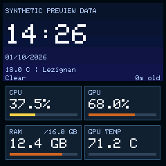
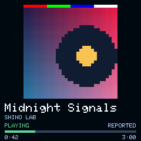
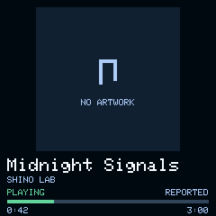
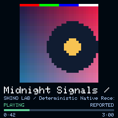
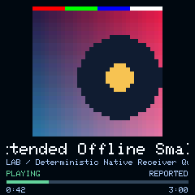
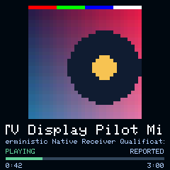
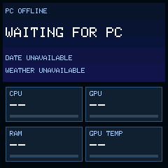

# V2.2 native scene engine — offline implementation

Continues Draft PR #40 and `codex/shino-tv-32-artwork-display-pilot` from
`ec20f32f5960d7181671655751ded137a84c2963`. The former combined screen is
retained below as historical engineering evidence. It is replaced by exclusive
IDLE, PLAYING, PAUSED, NO ARTWORK and OFFLINE scenes. **Offline implementation
PASS; physical scene/LCD qualification NOT RUN.** No device operation, companion
restart, network configuration, production provisioning or merge was performed.
Mission 8 / Draft PR #39 stays frozen at `9fce713`; R3 PARTIAL, R10 BLOCKED.

| IDLE | PLAYING | PAUSED | NO ARTWORK |
| --- | --- | --- | --- |
|  |  |  |  |

| Marquee start | Marquee middle | Marquee end | OFFLINE |
| --- | --- | --- | --- |
|  |  |  |  |

Every individual PNG is **exactly 240×240**. Pixels come from the actual C++
renderer, the pinned Arduino_GFX 1.6.4 classic font and RGB565 word expansion.
The optional [contact sheet](scenes/contact-sheet.png) copies eight independent
screens without rescaling. Clock/weather in `idle.png` are explicitly labelled
**SYNTHETIC PREVIEW DATA**. The native adapter has no time/weather provider and
never uses those fixture values.

## Implementation and ownership

[`SceneEngine.h`](../../firmware/include/display/SceneEngine.h) implements the
state machine, palette, validity leases, scene-specific painting and clipped
marquees. [`ArtworkAdapter.inc`](../../experiments/artwork_pilot/native/ArtworkAdapter.inc)
binds the same Canvas to the actual ST7789/HWSPI driver after HTTP servicing,
under the existing `networkReady` guard. `ArtworkPilot.h` is the stable include.

The existing native receiver validates signatures, schema, canonical JSON,
CRC and final image digest. Its opt-in display handoff now keeps **bounded
authenticated Begin presentation metadata** separately from committed image
ownership. Accepted Begin releases the old image and presents NO ARTWORK;
staging is never exposed. Commit moves the one verified image into `DisplaySink`.
Abort/expiry release all image and transaction resources while retaining only
the authenticated music fallback. Explicit clear, reboot or pending-principal
cancellation drops that presentation. Rejected metadata preserves the previous
committed owner and pixels. The macro-disabled receiver keeps its original
clear/terminal implementation; it is separately compiled in the resource check.

The renderer copies caption values and retains **no image/metadata pointer**.
Each cooperative step borrows the current sink and copies one source row before
calling GFX. Its SDK yield does not reenter the serialized HTTP/receiver owner.
No LCD operation occurs in ingress or ECDSA. RGB565LE is decoded with
`lo | hi<<8`; the pinned RAM bitmap/HWSPI path sends each native word MSB first
without modifying the source row. No 240×240 framebuffer or second artwork
allocation exists.

## Scenes, data and scrolling

IDLE uses a leased clock/date when trustworthy, fresh weather with displayed
cache age, and four 110×50 cards at (8,124), (122,124), (8,181), (122,181).
CPU/GPU percentages and RAM used/actual total retain the 20/50/80 boundaries and
reviewed two-percentage-point hysteresis. Initial bands are green below 20,
yellow below 50, dark orange below 80, burgundy at 80–100. RAM's denominator is
shown only when valid. **GPU TEMP is informational with a neutral track**;
temperature normalization remains an owner decision. Stale/unavailable cards
show `--` and neutral tracks. There are no decorative curves.

PLAYING and PAUSED use **160×160 integer 5×** artwork at (40,8), size-2 title
at (8,176), size-1 artist at (8,196), state at y210 and progress/time at y222/230.
The 128×128 integer 4× alternative passes the same host suite and native build.
Neither size allocates a scaled cover. All music scenes paint **zero metric
cards** while the adapter continues to accept and age the unchanged telemetry
snapshot in the background. The latest sample is painted on returning to IDLE.

The existing 16-field media wire carries position/duration in seconds but
**no observation timestamp or playback-rate contract**. Valid signed positions
are therefore shown as **REPORTED snapshots**, with no speculative live
interpolation; PAUSED freezes the same reported position. Null, missing or
zero duration yields `--:--` and a neutral progress track. No wire/schema change.

NO_SESSION and UNAVAILABLE return to IDLE, or OFFLINE when PC data are stale
and there is no trustworthy clock. STOPPED uses a bounded 300 ms debounce.
`Policy::pausedToIdleMs` is an explicit seam: **zero by default, retain PAUSED**.
No final pause timeout is imposed. An explicitly configured timeout latches
until a state change and cannot resurrect the scene at a timer rollover.

Title and artist keep all 60 allowed codepoints in 61-byte ASCII arrays.
Common Latin accents transliterate; unsupported glyphs map to one `?` each.
No ellipsis or font compression is used. Overflow alone activates scrolling:
1,500 ms initial dwell, 1 pixel/80 ms travel, 900 ms endpoint dwell, smooth
reverse travel, repeat at the origin. Track key, caption or scene changes reset
motion. Each eight-source-row sweep holds one offset; both text sweeps and
status/progress finish before another motion update, preventing starvation.
The 224-pixel viewports are rendered into the owned row buffer, including
background pixels. Fractional glyphs cannot escape their rectangles.

## Reproducible evidence and resource review

[33-case host results](scene-host-results.json) and the
[128-pixel comparison](scene128-host-results.json) execute the real native
Gate1/ECDSA/Gate2/receiver using ephemeral host signing fixtures. They cover
ownership/replacement/repeat, Begin fallback, interrupted body/Abort, rejected
metadata, all scene transitions, stale telemetry, provider leases/date rollover,
optional pause policy, overflow/dwell/bounce/reset/clipping, Unicode and progress.
Every render step checks zero C++ heap allocations and a 10,000-pixel work cap.
Windows runs use MSVC; ASan/UBSan execute on Linux in exact-head CI, including
both cover sizes. Host timing is not native LCD timing.

The [numeric native report](scene-native-resources.json) compares equivalent
unstarted full ESP8266 graphs with the same public key, inert policy, compiler,
partition and startup guard. `previous_pilot_compile` reads the exact prior
renderer/receiver/adapter from `ec20f32`; its retained 443,616-byte / 52,936-byte
DRAM reference is checked before comparison. Each generated adapter is replaced
when switching environments, preventing contamination by the previous graph.

| Resource | Previous PR #40 | V2.2 128px | V2.2 160px selected |
| --- | ---: | ---: | ---: |
| Padded BIN bytes | 443,616 | 449,072 | 449,072 |
| GNU text / data / bss | 436,175 / 3,352 / 32,640 | 440,895 / 4,080 / 32,640 | 440,895 / 4,080 / 32,640 |
| Persistent `.data + .rodata + .bss` | 52,936 | 54,016 | 54,016 |
| Renderer object | 276 | 860 | 860 |
| Native Receiver object | 1,328 | 1,472 | 1,472 |
| Owned row scratch | 192 | 448 | 448 |
| Additional renderer heap allocations | 0 | 0 | 0 |
| Artwork pixels per source-row slice | 288 | 512 | 800 |

**Delta: +5,456 BIN bytes and +1,080 static DRAM bytes.** The 448-byte text row
dominates both scale options, so 160 costs no extra RAM. Its whole-cover data
wire floor is 10.240 ms at 40 MHz, spread over 32 slices of 800 pixels (0.320 ms
data floor each); 128 is 6.5536 ms over 512-pixel slices (0.2048 ms). Text-row
slices are at most 448 pixels. The largest tested task is an IDLE metric card:
8,424 conservative pixel writes, 3.3696 ms SPI data floor. Transparent glyph-cell
counts overestimate actual ink writes; arithmetic excludes commands and SDK/SPI
costs. **Actual native LCD slice time/high-water NOT MEASURED.** Numeric timing
counters remain in the loop-side adapter for the separately approved device lab.

Compiler `.su` frames: Receiver Begin 784 B versus 720 (+64); metadata 416
versus 432 (-16); scene `sync` 64; step 80; header 144; text row/card 80;
adapter 96 versus 128; loop 32. These are individual frames, not complete runtime
stack high-water. Rendering and authentication are serialized, so their frames
are not concurrent. The 2,048-byte JSON arena/8-byte native alignment, 6,200-byte
secondary StackThunk, six-second metrics TTL and eight-second transaction
deadline remain unchanged. The default receiver graph still uses 52,416 static
DRAM bytes and a 1,120-byte Receiver object.

The offline static increment envelope is 2 KiB over the prior renderer; current
increment is 1,080 bytes. Relative to the public M8 graph it is 1,600 bytes.
Subtracting that from the historical final physical 18,816-byte heap gives only
an **arithmetic estimate of 17,216**, not a measured new heap or largest block.
Actual memory placement, native latency and authenticated reception coexistence
remain a mandatory physical gate. 48px work is unchanged/experimental.

```powershell
python -m platformio run -d experiments/artwork_pilot -e baseline_compile -e previous_pilot_compile -e scene128_compile -e pilot_compile
python tools/artwork_pilot_runner.py
python tools/artwork_pilot_runner.py --scale 4 --previews research-local/scene128-previews
python tools/artwork_pilot_resources.py --host-report research-local/scene-host.json
```

The first runner writes JSON to stdout; save it to the indicated host-report
file when using the last command. All native BINs are **unstarted public offline
artifacts, not owner installation candidates**. CI uploads both test reports,
eight-screen previews and the paired native measurements for its exact SHA.

## Remaining physical demonstration gate

1. Obtain separate approval for the exact physical operation and a newly
   reviewed installation image/hash with the owner's retained rollback policy.
   These guarded public experiment BINs cannot be installed as-is.
2. Verify current LCD/telemetry/recovery and rollback hashes; follow the approved
   network/installation procedure. Rediscover and verify OEM `/v.json` if that
   procedure uses OEM; its historical LAN IP is not guaranteed.
3. Use authenticated deterministic 32px fixtures to inspect the separate idle,
   playing, pause, fallback and moving-caption scenes on the real LCD. Retain
   synthetic labels if clock/weather fixtures are deliberately included; native
   production providers are not implemented.
4. Measure actual slice latency, heap/largest block/fragmentation, continuation
   and secondary-stack high-water alongside telemetry and OEM recovery. Stop on
   unsafe memory, reset/canary/cleanup failure or visual regression. Do not
   repeat frozen Mission 8 qualifications or infer their failure from a timeout.

Owner's final pause delay, temperature normalization and real time/weather
providers remain independent decisions. No home-STA, native OTA or permanent
media sender was introduced.

---

# Historical combined-screen proof — retained unchanged

Implemented offline from validated Mission 8 head
`9fce7137f9fadd83678887442bf91cf60ea86b2e`. Mission 8's six reports,
physical evidence, installed 446,944-byte candidate, rollback kit and Draft
PR #39 are preserved. This follow-on branch is development work. R3 remains
PARTIAL; R10 remains BLOCKED. There is no production provisioning, permanent
media sender, Spotify integration, 48px redesign or device operation.


The 240x240 composition uses a 96x96 nearest-neighbor cover at (8,8), a
120px text column and four 108x54 cards. CPU, GPU, RAM in GB and GPU TEMP in
Celsius remain visible. Labels use the actual classic 6x8 GFX font; values
use size 2 when they fit, otherwise size 1. Percentage denominators, missing
GPU handling, stale neutral bars, palette and two-percentage-point hysteresis
come from the existing `DashboardV2` rules. The six-second telemetry TTL and
250ms minimum telemetry redraw interval are unchanged.

## Native connection and ownership

`firmware/include/display/ArtworkPilot.h` contains the allocation-free renderer.
`experiments/artwork_pilot/native/ArtworkAdapter.inc` binds it to the actual
Arduino_ST7789/Arduino_HWSPI driver and `FslessMetrics`. The offline build
generator inserts its call after `server.handleClient()` returns, in the
existing FirstBootBridge loop. No authentication or receiver handler calls LCD
code. The existing `networkReady` guard is retained so an AP startup failure
keeps its diagnostic LCD screen. Both public native graphs have a volatile,
zero-valued startup guard.
Their default setup does not start Wi-Fi or the receiver; their loop sleeps.
**These compiled BINs are not owner installation candidates.**

The `SHINO_ARTWORK_DISPLAY_PILOT` macro adds bounded caption, extent and revision
fields to the existing native receiver. With the macro absent, its original
layout and behavior remain unchanged. Text is copied only after strict native
metadata validation. Commit moves the actual staging allocation into
`DisplaySink::image`, then publishes the caption, extent and revision. The
renderer never sees staging and never owns or stores an image pointer.

Each `step()` borrows the current sink for that call only. It copies one source
row to its own 192-byte scanline before invoking the driver. Caption lines
likewise use a bounded local copy. GFX can yield to ESP8266 SDK background work;
it does not reenter the serialized HTTP owner. The integration assumes all
receiver mutations remain on that owner, as in the pinned existing runtime.
No renderer scratch overlaps the JSON arena, incoming body or StackThunk.

The existing receiver contract deliberately clears the prior allocation on a
valid Begin. Consequently the pilot cooperatively clears the artwork/text area
and shows `NO ARTWORK` / `NO SESSION` during a pending or aborted transfer.
Commit publishes the new complete image. Invalid metadata leaves the old sink,
revision and LCD unchanged. Clear, Abort and expiry return to fallback. PAUSED
and STOPPED retain the supplied committed cover and show their state. Coverless
NO_SESSION shows fallback. Invalid pointer/extent combinations fail closed;
48px images get a `32px PILOT` placeholder. Metrics continue in every state.

Replacement clears the top area in fourteen 8px stripes, then paints seven
caption tasks and 32 source-row tasks. Initialization also uses 8px stripes.
Changed metrics take priority and each card occupies one bounded task.
Same-cover repeat is a new receiver Commit; unchanged steady state draws nothing.
There is no native full-display or full-scaled-cover framebuffer.

RGB565LE is explicitly decoded with `lo | (hi << 8)`. The driver's RAM bitmap
overload sends native words through `Arduino_HWSPI::writePixels()`, which emits
the most significant byte first. The source/display red-green-blue-white strip
and all 9,216 enlarged pixels are checked. Driver/font fingerprints appear in
`native-resources.json`; the exact font is used by the software canvas.
Physical color/orientation confirmation remains pending.

## Offline validation and resource results

`host-results.json`: 16 scenarios, 33,737 checks, all passing under local MSVC.
The tests use actual `MediaIngress`, `Authority`, `Receiver`, ArduinoJson 7.4.3
and the pinned BearSSL m31 verifier. Deterministic covers are signed with an
ephemeral host key; no key is retained. Tests cover initial Commit, replacement
during drawing, repeat, an accepted tile followed by an interrupted body and
authenticated Abort, metadata denial, coverless state, playback states, all four
telemetry values/staleness, unknown GPU/RAM denominator, long caption truncation,
UTF-8 bitmap fallback, invalid ownership, expiry and unsupported 48px ownership.
The renderer has zero observed C++ heap allocations during render steps.
No ingress operation performs an LCD call. CI additionally runs ASan/UBSan.

The [review sheet](previews/contact-sheet.png) and nine individual 240x240 PNGs
were generated by the same C++ renderer. Full framebuffer storage exists only
inside the host software LCD, never on ESP8266. Unsupported Unicode codepoints
become one `?`; title/artist truncation uses `...` without widening the schema.

| Linked graph | BIN bytes | .data | .bss | Static DRAM (.data + .rodata + .bss) |
| --- | ---: | ---: | ---: | ---: |
| Frozen validated M8 owner candidate | 446,944 | 2,816 | 32,712 | 52,508 |
| Equivalent public offline baseline | 443,616 | 2,816 | 32,696 | 52,416 |
| Equivalent public offline pilot | 443,616 | 3,296 | 32,640 | 52,936 |
| Paired pilot delta | 0 | +480 | -56 | **+520** |

The paired graphs use identical inert OEM policy and public test key. The frozen
owner candidate has its previously compiled recovery policy; comparing its raw
size directly to the public graph does not isolate the renderer. Paired GNU
text/data/bss deltas are -468/+480/-56 bytes (+12 linked text/data bytes before
BIN padding). The renderer is 276 bytes, including
its 192-byte row; timing counters are 12 bytes. Receiver object size is 1,328
versus 1,120 bytes. There is no new image or heap buffer. The 2,048-byte JSON
arena and 6,200-byte temporary crypto stack are unchanged.

Native compiler frames: loop 32 bytes, adapter 128, renderer step 48, card/line
helpers 80, LCD adapter methods 48. Receiver Begin's frame grows from 624 to
720 bytes; metadata validation stays 432 bytes. Driver text/row frames are
recorded separately. These are compiler frames, **not a measured whole-chain
high-water bound**. LCD and ECDSA execute sequentially, on separate loop phases.

Local software top-area rendering measured 12 microseconds in the recorded run;
host timings vary and are not ESP8266 LCD timing. The largest exercised slice
writes 9,840 pixels. At the configured 40MHz SPI rate, its pixel data alone
requires at least 3.936ms; the 96x96 cover alone requires at least 3.6864ms.
Commands, font operations, SDK yields and network work add time. Native counters
for last/max slice duration are compiled into the adapter, but no device timing
or native high-water measurement was performed.

The +520 static bytes and +96 Begin-frame bytes must be included in the next
physical memory review. Subtracting 520 from M8's final observed 18,816-byte heap
gives only an arithmetic estimate of 18,296, not a new measured margin. Actual
heap, largest block, fragmentation and continuation stack require the approved
demonstration. Recovery capacity is preserved in the inherited owner pipeline;
its private-policy link and live capability must be reverified separately.

## Reproduce without a device

```sh
python -m pip install 'platformio==6.1.18' 'Pillow>=10,<13'
python -m platformio run -d experiments/artwork_pilot -e baseline_compile -e pilot_compile
python tools/artwork_pilot_runner.py --previews research-local/artwork-previews
python tools/artwork_pilot_resources.py
```

Windows uses MSVC BuildTools; Linux uses GCC with ASan/UBSan for the C++ receiver
and renderer. The public offline profile rejects a supplied private install
policy. Build outputs and temporary fixture material remain ignored. No device
IP, upload command, OEM return or reboot is part of these tools.

## Before a separately approved physical LCD demonstration

1. Review this code and previews, then obtain explicit physical-installation
   authorization and a current owner LCD observation. Keep the frozen M8 evidence.
2. Create and review a separate owner-policy demonstration build from this exact
   reviewed source. Its startup guard must be deliberately enabled, OEM recovery
   retained, SHA/size recorded and read-only slice timing counters exposed.
   Reverify rollback hashes and the live recovery path before any installation.
3. Under that approval only, use the established controlled OEM/SHINO transition,
   rediscovering the live OEM LAN address and checking `/v.json` each time.
4. Send the deterministic signed 32px fixture through the unchanged receiver.
   Confirm color order, orientation, caption readability, all four updating
   metrics, replacement/fallback and automatic LINK continuity on the LCD.
5. Measure slice latency, heap/largest block/fragmentation, continuation margin,
   resets and recovery availability during committed display and replacement.
   Stop for regressions or unsafe margins. Do not enable 48px or production keys.

Offline implementation: PASS. Physical artwork display: NOT RUN. Production:
HOLD under the independent R3/R10 gates.
