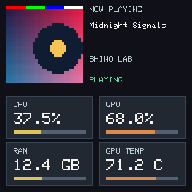

# 32px native artwork display pilot

Implemented offline from validated Mission 8 head
`9fce7137f9fadd83678887442bf91cf60ea86b2e`. Mission 8's six reports,
physical evidence, installed 446,944-byte candidate, rollback kit and Draft
PR #39 are preserved. This follow-on branch is development work. R3 remains
PARTIAL; R10 remains BLOCKED. There is no production provisioning, permanent
media sender, Spotify integration, 48px redesign or device operation.



The 240x240 composition uses a 96x96 nearest-neighbor cover at (8,8), a
120px text column and four 108x54 cards. CPU, GPU, RAM in GB and GPU TEMP in
Celsius remain visible. Labels use the actual classic 6x8 GFX font; values
use size 2 when they fit, otherwise size 1. Percentage denominators, missing
GPU handling, stale neutral bars, palette and two-percentage-point hysteresis
come from the existing `DashboardV2` rules. The six-second telemetry TTL and
250ms minimum telemetry redraw interval are unchanged.

## Native connection and ownership

`firmware/include/display/ArtworkPilot.h` contains the allocation-free renderer.
`experiments/artwork_pilot/native/ArtworkAdapter.inc` binds it to the actual
Arduino_ST7789/Arduino_HWSPI driver and `FslessMetrics`. The offline build
generator inserts its call after `server.handleClient()` returns, in the
existing FirstBootBridge loop. No authentication or receiver handler calls LCD
code. The existing `networkReady` guard is retained so an AP startup failure
keeps its diagnostic LCD screen. Both public native graphs have a volatile,
zero-valued startup guard.
Their default setup does not start Wi-Fi or the receiver; their loop sleeps.
**These compiled BINs are not owner installation candidates.**

The `SHINO_ARTWORK_DISPLAY_PILOT` macro adds bounded caption, extent and revision
fields to the existing native receiver. With the macro absent, its original
layout and behavior remain unchanged. Text is copied only after strict native
metadata validation. Commit moves the actual staging allocation into
`DisplaySink::image`, then publishes the caption, extent and revision. The
renderer never sees staging and never owns or stores an image pointer.

Each `step()` borrows the current sink for that call only. It copies one source
row to its own 192-byte scanline before invoking the driver. Caption lines
likewise use a bounded local copy. GFX can yield to ESP8266 SDK background work;
it does not reenter the serialized HTTP owner. The integration assumes all
receiver mutations remain on that owner, as in the pinned existing runtime.
No renderer scratch overlaps the JSON arena, incoming body or StackThunk.

The existing receiver contract deliberately clears the prior allocation on a
valid Begin. Consequently the pilot cooperatively clears the artwork/text area
and shows `NO ARTWORK` / `NO SESSION` during a pending or aborted transfer.
Commit publishes the new complete image. Invalid metadata leaves the old sink,
revision and LCD unchanged. Clear, Abort and expiry return to fallback. PAUSED
and STOPPED retain the supplied committed cover and show their state. Coverless
NO_SESSION shows fallback. Invalid pointer/extent combinations fail closed;
48px images get a `32px PILOT` placeholder. Metrics continue in every state.

Replacement clears the top area in fourteen 8px stripes, then paints seven
caption tasks and 32 source-row tasks. Initialization also uses 8px stripes.
Changed metrics take priority and each card occupies one bounded task.
Same-cover repeat is a new receiver Commit; unchanged steady state draws nothing.
There is no native full-display or full-scaled-cover framebuffer.

RGB565LE is explicitly decoded with `lo | (hi << 8)`. The driver's RAM bitmap
overload sends native words through `Arduino_HWSPI::writePixels()`, which emits
the most significant byte first. The source/display red-green-blue-white strip
and all 9,216 enlarged pixels are checked. Driver/font fingerprints appear in
`native-resources.json`; the exact font is used by the software canvas.
Physical color/orientation confirmation remains pending.

## Offline validation and resource results

`host-results.json`: 16 scenarios, 33,737 checks, all passing under local MSVC.
The tests use actual `MediaIngress`, `Authority`, `Receiver`, ArduinoJson 7.4.3
and the pinned BearSSL m31 verifier. Deterministic covers are signed with an
ephemeral host key; no key is retained. Tests cover initial Commit, replacement
during drawing, repeat, an accepted tile followed by an interrupted body and
authenticated Abort, metadata denial, coverless state, playback states, all four
telemetry values/staleness, unknown GPU/RAM denominator, long caption truncation,
UTF-8 bitmap fallback, invalid ownership, expiry and unsupported 48px ownership.
The renderer has zero observed C++ heap allocations during render steps.
No ingress operation performs an LCD call. CI additionally runs ASan/UBSan.

The [review sheet](previews/contact-sheet.png) and nine individual 240x240 PNGs
were generated by the same C++ renderer. Full framebuffer storage exists only
inside the host software LCD, never on ESP8266. Unsupported Unicode codepoints
become one `?`; title/artist truncation uses `...` without widening the schema.

| Linked graph | BIN bytes | .data | .bss | Static DRAM (.data + .rodata + .bss) |
| --- | ---: | ---: | ---: | ---: |
| Frozen validated M8 owner candidate | 446,944 | 2,816 | 32,712 | 52,508 |
| Equivalent public offline baseline | 443,616 | 2,816 | 32,696 | 52,416 |
| Equivalent public offline pilot | 443,616 | 3,296 | 32,640 | 52,936 |
| Paired pilot delta | 0 | +480 | -56 | **+520** |

The paired graphs use identical inert OEM policy and public test key. The frozen
owner candidate has its previously compiled recovery policy; comparing its raw
size directly to the public graph does not isolate the renderer. Paired GNU
text/data/bss deltas are -468/+480/-56 bytes (+12 linked text/data bytes before
BIN padding). The renderer is 276 bytes, including
its 192-byte row; timing counters are 12 bytes. Receiver object size is 1,328
versus 1,120 bytes. There is no new image or heap buffer. The 2,048-byte JSON
arena and 6,200-byte temporary crypto stack are unchanged.

Native compiler frames: loop 32 bytes, adapter 128, renderer step 48, card/line
helpers 80, LCD adapter methods 48. Receiver Begin's frame grows from 624 to
720 bytes; metadata validation stays 432 bytes. Driver text/row frames are
recorded separately. These are compiler frames, **not a measured whole-chain
high-water bound**. LCD and ECDSA execute sequentially, on separate loop phases.

Local software top-area rendering measured 12 microseconds in the recorded run;
host timings vary and are not ESP8266 LCD timing. The largest exercised slice
writes 9,840 pixels. At the configured 40MHz SPI rate, its pixel data alone
requires at least 3.936ms; the 96x96 cover alone requires at least 3.6864ms.
Commands, font operations, SDK yields and network work add time. Native counters
for last/max slice duration are compiled into the adapter, but no device timing
or native high-water measurement was performed.

The +520 static bytes and +96 Begin-frame bytes must be included in the next
physical memory review. Subtracting 520 from M8's final observed 18,816-byte heap
gives only an arithmetic estimate of 18,296, not a new measured margin. Actual
heap, largest block, fragmentation and continuation stack require the approved
demonstration. Recovery capacity is preserved in the inherited owner pipeline;
its private-policy link and live capability must be reverified separately.

## Reproduce without a device

```sh
python -m pip install 'platformio==6.1.18' 'Pillow>=10,<13'
python -m platformio run -d experiments/artwork_pilot -e baseline_compile -e pilot_compile
python tools/artwork_pilot_runner.py --previews research-local/artwork-previews
python tools/artwork_pilot_resources.py
```

Windows uses MSVC BuildTools; Linux uses GCC with ASan/UBSan for the C++ receiver
and renderer. The public offline profile rejects a supplied private install
policy. Build outputs and temporary fixture material remain ignored. No device
IP, upload command, OEM return or reboot is part of these tools.

## Before a separately approved physical LCD demonstration

1. Review this code and previews, then obtain explicit physical-installation
   authorization and a current owner LCD observation. Keep the frozen M8 evidence.
2. Create and review a separate owner-policy demonstration build from this exact
   reviewed source. Its startup guard must be deliberately enabled, OEM recovery
   retained, SHA/size recorded and read-only slice timing counters exposed.
   Reverify rollback hashes and the live recovery path before any installation.
3. Under that approval only, use the established controlled OEM/SHINO transition,
   rediscovering the live OEM LAN address and checking `/v.json` each time.
4. Send the deterministic signed 32px fixture through the unchanged receiver.
   Confirm color order, orientation, caption readability, all four updating
   metrics, replacement/fallback and automatic LINK continuity on the LCD.
5. Measure slice latency, heap/largest block/fragmentation, continuation margin,
   resets and recovery availability during committed display and replacement.
   Stop for regressions or unsafe margins. Do not enable 48px or production keys.

Offline implementation: PASS. Physical artwork display: NOT RUN. Production:
HOLD under the independent R3/R10 gates.
