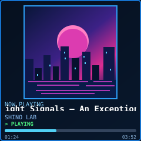

# SHINO // TV — canonical 240×240 visual reference assets (1 October 2026)

These are **four self-contained square SVG mockups** authored with `width="240"`, `height="240"`, and `viewBox="0 0 240 240"`. Each screen is an independent **1:1 coordinate canvas**, not an illustration labelled 240×240. Images are the owner-approved DIRECTION of the desired final UX; the current PR #40 software LCD preview (96×96 cover + metrics side-by-side) is an integration proof and **not the target final scene**.

| Scene | SVG reference | Runtime intent |
| --- | --- | --- |
| IDLE |  | Large time (only when synchronized), date/weather (only when valid), the FOUR adaptive-bar metric cards. No decorative mini-curves. |
| PLAYING |  | Prominent square cover, title/artist/status, optional progress. **ZERO metric cards.** |
| PAUSED |  | Square cover, clearly distinguishable paused status and frozen progress. **ZERO metric cards.** |
| NO ARTWORK |  | Music-only placeholder with title/artist/progress. **ZERO metric cards.** |
| Long title demonstration |  | A sampled shifted marquee frame; implement actual timed horizontal clipping in C++ rather than compressing font. |

## Coordinates / implementation contract

- IDLE scenic upper panel: x 4–235, y 4–117. Metric cards (x,y,w,h): `(8,124,110,50)`, `(122,124,110,50)`, `(8,181,110,50)`, `(122,181,110,50)`.
- PLAYING/PAUSED/NO ARTWORK cover/placeholder: `(41,10,158,158)` (SQUARE). Music caption/status/progress region y 170–236.
- No title/artwork rendering extends beyond 240 pixels. Revisit actual type legibility with the 6×8 pinned GFX font. **These SVGs are visual targets, not firmware screenshots, not proof of RGB565/LCD feasibility.** The actual supported network image is currently a **32×32 RGB565LE RAM cover**, suitable for bounded nearest-neighbour upscale to a chosen visual square without allocating a new full-screen framebuffer. Do not assume the existing 96×96 scaling is mandatory; measure 158×158 pixel work before committing it.
- The idle mock values are illustrative. CPU 37.5% intentionally uses **YELLOW**, GPU 68% dark-orange, RAM used 12.4/16 GB dark-orange, not arbitrary decorative colours; temperature's normalization is still an owner decision. Palette: 0–20 green, 20–50 yellow, 50–80 dark-orange, 80–100 burgundy, with reviewed boundaries/hysteresis. Never fake unavailable readings or weather.
- Slowly scrolling overflow title: maintain a clipped viewport, initial delay, bounded velocity and end hold, reset on track change. Avoid truncation as final UX; a fallback ellipsis is permitted only when renderer/font capability has a documented blocker.

## Machine rendering and verification

Each SVG is vector source fixed to a 240×240 viewport. For pixel-exact PNG references, render each **separately** with an SVG rasterizer (example: `cairosvg.svg2png(url="docs/design-reference/idle.svg",write_to="idle-240.png",output_width=240,output_height=240)`) and assert `Image.open(...).size==(240,240)`. Do not resize a four-screen contact sheet; do not distort square artwork. The production implementation must instead test the actual ST7789, RGB565, GFX font, RAM limits, heap/stack and cooperative rendering.

For the complete product decisions, implementation gates and source precedence see [../AGENT_HANDOFF.md](../AGENT_HANDOFF.md) and [../ROADMAP.md](../ROADMAP.md).
